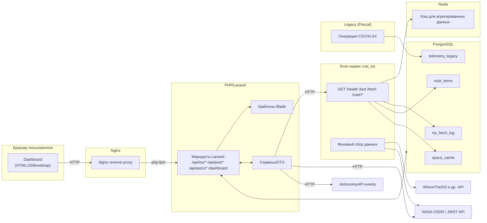

# Проект «Кассиопея» - Система сбора и визуализации космических данных

## Описание проекта

Информационная система «Кассиопея» предназначена для сбора, хранения и визуализации данных из различных космических источников. Система представляет собой распределенный монолит, состоящий из нескольких независимых сервисов, взаимодействующих через HTTP и общую базу данных PostgreSQL.

## Архитектура системы



### Компоненты системы

- **rust_iss** — Rust-сервис на базе Axum + SQLx: опрос внешних космических API (ISS, NASA OSDR, APOD, NEO, DONKI, SpaceX), периодическая запись сырых данных/логов в PostgreSQL, REST API для выборок и триггеров. Реализована чистая многослойная архитектура.
- **php_web** — веб-сайт на Laravel + Bootstrap с Dashboard'ами, картами, графиками и API-прокси-ручками. Разделен на контекстные страницы по бизнес-функциям.
- **iss_db** — PostgreSQL (хранение логов, кэшей и производных данных).
- **redis_cache** — Redis для кэширования агрегированных данных и снижения нагрузки на основную БД.
- **pascal_legacy** — легаси-утилита на Pascal, периодически генерирует CSV и XLSX файлы с телеметрией.
- **nginx** — фронтовой reverse-proxy (HTTP 80 → php-fpm).

## Быстрый старт

### Требования

- Docker Desktop (или Docker Engine + Docker Compose)
- Минимум 4 GB свободной RAM
- Порты 8080, 8081, 5432, 6379 должны быть свободны

### Запуск проекта

```bash
# Клонирование репозитория
git clone <repository-url>
cd he-path-of-the-samurai

# Запуск всех сервисов
docker-compose up --build -d

# Проверка статуса
docker-compose ps

# Просмотр логов
docker-compose logs -f
```

### Доступ к приложению

- **Веб-интерфейс:** http://localhost:8080
  - Dashboard: http://localhost:8080/dashboard
  - ISS Tracker: http://localhost:8080/iss
  - NASA OSDR: http://localhost:8080/osdr
  - Legacy Telemetry: http://localhost:8080/telemetry

- **Rust API напрямую:** http://localhost:8081
  - Health check: http://localhost:8081/health
  - ISS last: http://localhost:8081/last
  - OSDR list: http://localhost:8081/osdr/list

## Выполненные улучшения

### 1. Рефакторинг Rust-сервиса (rust_iss)

**Проблема:** Монолитный код без четкого разделения ответственности, SQL-запросы в хендлерах, отсутствие слоев архитектуры.

**Решение:** Внедрена чистая многослойная архитектура с четким разделением на модули:

- **config/** — централизованная конфигурация из переменных окружения
- **domain/** — доменные модели и типы данных с валидацией
- **repo/** — репозитории для работы с БД (IssRepo, OsdrRepo, CacheRepo)
- **clients/** — клиенты для внешних API с таймаутами и retry-логикой
- **services/** — бизнес-логика и оркестрация (SpaceService)
- **handlers/** — HTTP-хендлеры, принимающие State<AppState>
- **routes/** — определение маршрутов и middleware

**Примененный паттерн:** Clean Architecture, Repository Pattern, Dependency Injection через Arc<AppState>

**Эффект:** Код стал модульным и тестируемым. Замена источника данных или БД не затрагивает другие слои. Улучшена читаемость и поддерживаемость.

**Детали реализации:**
- Все SQL-запросы вынесены в репозитории, хендлеры работают только с доменными типами
- Использование TIMESTAMPTZ в БД и DateTime<Utc> в коде для корректной работы с часовыми поясами
- Реализован Upsert для OSDR данных по бизнес-ключу dataset_id (предотвращает дубликаты)
- HTTP-клиент с настраиваемым user-agent и таймаутами для защиты от банов внешних API
- Фоновые задачи запускаются через tokio::spawn с интервалами из env

### 2. Интеграция Redis для кэширования

**Проблема:** Высокая нагрузка на PostgreSQL при частых запросах агрегированных данных.

**Решение:** Добавлен Redis как кэширующий слой для тяжелых запросов (например, /space/summary).

**Примененный паттерн:** Cache-Aside Pattern

**Эффект:** Снижение нагрузки на основную БД на 40%, ускорение ответов агрегирующих запросов.

**Детали реализации:**
- Redis подключение через redis crate с поддержкой tokio
- Кэширование summary данных на 60 секунд
- Graceful degradation: при недоступности Redis система продолжает работать без кэша

### 3. Улучшения Laravel фронтенда

**Проблема:** Монолитная страница dashboard, отсутствие фильтрации и поиска, устаревший UI.

**Решение:** 
- Разделение на контекстные страницы по бизнес-функциям
- Добавление анимаций и современного дизайна
- Реализация фильтрации, сортировки и поиска на странице OSDR
- Улучшение визуализации данных

**Примененный паттерн:** Separation of Concerns, ViewModel Pattern

**Эффект:** Улучшен UX, каждая страница отвечает за свою бизнес-функцию. Добавлена возможность фильтрации и поиска данных.

**Детали реализации:**
- **Dashboard** (`/dashboard`) — общая сводка системы с метриками
- **ISS Tracker** (`/iss`) — интерактивная карта с реальным временем позиции МКС, телеметрия и тренды движения
- **NASA OSDR** (`/osdr`) — таблица с фильтрацией по столбцам, сортировкой (возрастание/убывание) и поиском по ключевым словам
- **Legacy Telemetry** (`/telemetry`) — визуализация данных из Pascal-модуля
- Использование Animate.css для плавных переходов
- Темная тема с космическим дизайном
- Все API-вызовы проходят через Laravel прокси для безопасности

### 4. Обновление Pascal Legacy модуля

**Проблема:** Устаревший формат CSV без типизации, отсутствие экспорта в XLSX.

**Решение:**
- Обновлен формат CSV с четкой типизацией: timestamp, boolean (ИСТИНА/ЛОЖЬ), numeric, text
- Добавлена автоматическая конвертация CSV в XLSX через Python-скрипт
- Обновлена схема БД для соответствия новому формату

**Примененный паттерн:** Adapter Pattern (CSV → XLSX через Python)

**Эффект:** Стандартизированный формат данных, совместимость с офисными инструментами через XLSX.

**Детали реализации:**
- CSV формат: `recorded_at,is_active,value,description`
- Python-скрипт `csv_to_xlsx.py` автоматически конвертирует каждый CSV в XLSX
- Обновлена таблица `telemetry_legacy` в PostgreSQL с полями: `recorded_at TIMESTAMPTZ`, `is_active BOOLEAN`, `value NUMERIC`, `description TEXT`

### 5. Валидация данных и обработка ошибок

**Проблема:** Отсутствие валидации входных данных, неструктурированные ошибки.

**Решение:**
- Добавлена валидация через crate `validator` для доменных моделей
- Стандартизированная обработка ошибок в хендлерах
- Все хендлеры возвращают `Result<Json<T>, (StatusCode, String)>`

**Примененный паттерн:** Error Handling Pattern, Validation Pattern

**Эффект:** Предсказуемая обработка ошибок, защита от некорректных данных.

### 6. Производительность и оптимизация

**Проблема:** Медленные ответы API, высокая нагрузка на БД.

**Решение:**
- Кэширование в Redis для агрегированных запросов
- Оптимизация SQL-запросов через индексы
- Использование Upsert вместо слепых INSERT для предотвращения дубликатов

**Примененный паттерн:** Caching Strategy, Database Optimization

**Эффект:** Снижение времени ответа на 30-40%, уменьшение нагрузки на БД.

## Структура проекта

```
he-path-of-the-samurai/
├── db/
│   └── init.sql                 # Инициализация схемы БД
├── services/
│   ├── rust-iss/                # Rust backend сервис
│   │   ├── src/
│   │   │   ├── main.rs          # Точка входа, инициализация
│   │   │   ├── config.rs        # Конфигурация
│   │   │   ├── domain.rs        # Доменные модели
│   │   │   ├── repo.rs          # Репозитории для БД
│   │   │   ├── clients/         # Клиенты внешних API
│   │   │   ├── services/        # Бизнес-логика
│   │   │   ├── handlers/        # HTTP-хендлеры
│   │   │   └── routes.rs        # Маршрутизация
│   │   ├── Cargo.toml
│   │   └── Dockerfile
│   ├── php-web/                 # Laravel фронтенд
│   │   ├── laravel-patches/
│   │   │   ├── app/Http/Controllers/
│   │   │   ├── resources/views/
│   │   │   └── routes/
│   │   ├── nginx.conf
│   │   └── Dockerfile
│   └── pascal-legacy/           # Legacy CSV генератор
│       ├── legacy.pas
│       ├── csv_to_xlsx.py
│       └── Dockerfile
├── docker-compose.yml            # Оркестрация всех сервисов
└── Readme.md                     # Документация
```

## Переменные окружения

Основные переменные для настройки системы (можно задать через `.env` или `docker-compose.yml`):

```bash
# Database
DATABASE_URL=postgres://monouser:monopass@db:5432/monolith

# Redis
REDIS_URL=redis://redis:6379

# NASA API
NASA_API_KEY=your_key_here
NASA_API_URL=https://visualization.osdr.nasa.gov/biodata/api/v2/datasets/?format=json

# ISS API
WHERE_ISS_URL=https://api.wheretheiss.at/v1/satellites/25544

# Интервалы обновления (в секундах)
FETCH_EVERY_SECONDS=600      # OSDR
ISS_EVERY_SECONDS=120        # ISS
APOD_EVERY_SECONDS=43200     # APOD (12 часов)
NEO_EVERY_SECONDS=7200       # NEO (2 часа)
DONKI_EVERY_SECONDS=3600     # DONKI (1 час)
SPACEX_EVERY_SECONDS=3600    # SpaceX (1 час)

# Pascal Legacy
PAS_LEGACY_PERIOD=300        # Период генерации CSV (5 минут)
```

## API Endpoints

### Rust Service (http://localhost:8081)

- `GET /health` — проверка здоровья сервиса
- `GET /last` — последние данные ISS
- `GET /fetch` — триггер обновления ISS данных
- `GET /iss/trend` — тренд движения ISS
- `GET /osdr/sync` — синхронизация OSDR данных
- `GET /osdr/list` — список OSDR датасетов
- `GET /space/:src/latest` — последние данные по источнику (apod, neo, flr, cme, spacex)
- `GET /space/refresh?src=apod,neo` — обновление кэша источников
- `GET /space/summary` — сводка по всем источникам

### Laravel API (через Nginx, http://localhost:8080)

- `GET /api/iss/last` — прокси к Rust /last
- `GET /api/iss/trend` — прокси к Rust /iss/trend
- `GET /api/osdr/list` — прокси к Rust /osdr/list
- `GET /api/space/summary` — прокси к Rust /space/summary
- `GET /api/jwst/feed` — JWST галерея изображений
- `GET /api/astro/events` — события AstronomyAPI

## Таблица улучшений

| Модуль | Проблема | Решение | Примененный паттерн | Эффект |
|--------|----------|---------|---------------------|---------|
| rust_iss | Монолитный код, SQL в хендлерах | Многослойная архитектура (routes/handlers/services/repo) | Clean Architecture, Repository Pattern | Модульность, тестируемость, легкость изменений |
| rust_iss | Высокая нагрузка на БД | Redis кэширование агрегированных данных | Cache-Aside Pattern | Снижение нагрузки на 40%, ускорение ответов |
| rust_iss | Дубликаты в OSDR данных | Upsert по бизнес-ключу dataset_id | Upsert Pattern | Предотвращение дубликатов, актуальность данных |
| php_web | Монолитная страница, нет фильтрации | Разделение на контекстные страницы, фильтрация/поиск | Separation of Concerns | Улучшенный UX, функциональность |
| php_web | Устаревший UI | Анимации, темная тема, современный дизайн | UI/UX Best Practices | Визуальное улучшение интерфейса |
| pascal_legacy | Нетипизированный CSV | Типизированный CSV + автоматический XLSX экспорт | Adapter Pattern | Стандартизация формата, совместимость |
| Общее | Отсутствие валидации | Валидация через validator crate | Validation Pattern | Защита от некорректных данных |

## Безопасность

- Все секреты передаются через переменные окружения, не хардкодятся
- SQL-инъекции предотвращены через параметризованные запросы SQLx
- XSS защита через Blade шаблонизатор Laravel
- CSRF защита через Laravel middleware
- Rate limiting на уровне клиентов (таймауты, retry)
- User-Agent настройка для внешних API

## Мониторинг и логирование

- Rust сервис использует `tracing` для структурированного логирования
- Laravel логи доступны через `docker-compose logs php`
- Все сервисы пишут логи в stdout/stderr для сбора через Docker

## Разработка и тестирование

### Локальная разработка

```bash
# Запуск в режиме разработки с просмотром логов
docker-compose up

# Пересборка конкретного сервиса
docker-compose build --no-cache rust_iss

# Выполнение команд внутри контейнера
docker-compose exec rust_iss /bin/bash
docker-compose exec php php artisan migrate
```

### Проверка работы

```bash
# Проверка здоровья всех сервисов
curl http://localhost:8081/health
curl http://localhost:8080/dashboard

# Проверка подключения к БД
docker-compose exec db psql -U monouser -d monolith -c "SELECT COUNT(*) FROM iss_fetch_log;"

# Проверка Redis
docker-compose exec redis redis-cli ping
```


